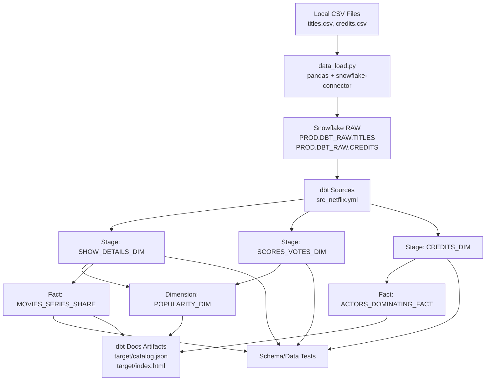

# dbt Snowflake Project (Netflix Analytics)

End-to-end dbt + Snowflake project that loads Netflix datasets from CSV, builds curated stage/dimension/fact models, applies tests, and generates dbt docs.

This repository is designed so a beginner can set it up locally and run the full pipeline independently.

## Architecture



## Tech stack

- dbt Core (`dbt-snowflake` adapter)
- Snowflake
- Python 3 + virtual environment
- `pandas`, `snowflake-connector-python`, `python-dotenv`
- Git Bash / shell script automation (`run_pipeline.sh`)

## Repository structure

```text
dbt-snowflake-project/
  README.md
  netflix_dbt/
    dbt_project.yml
    run_pipeline.sh
    .dbt_profiles/
      profiles.example.yml
    datasets/
      data_load.py
      titles.csv
      credits.csv
    models/netflix/
      stage/
        src_netflix.yml
        stage_netflix.yml
        SHOW_DETAILS_DIM.sql
        SCORES_VOTES_DIM.sql
        CREDITS_DIM.sql
      dimension/
        POPULARITY_DIM.sql
      fact/
        MOVIES_SERIES_SHARE.sql
        ACTORS_DOMINATING_FACT.sql
        fact_netflix.yml
```

## Data model summary

### Stage models

1. `SHOW_DETAILS_DIM`
- Core title attributes (`ID`, `TITLE`, `TYPE`, `RELEASE_YEAR`, etc.) from `TITLES` source.

2. `SCORES_VOTES_DIM`
- IMDb/TMDb metrics by `ID` from `TITLES` source.

3. `CREDITS_DIM`
- Filtered talent dataset (`ROLE IN ('ACTOR','DIRECTOR')`) from `CREDITS` source.

### Dimension model

1. `POPULARITY_DIM`
- Joins title details + score/vote metrics and applies null-safe defaults.

### Fact models

1. `MOVIES_SERIES_SHARE`
- Genre-level movie vs show percentage distribution.

2. `ACTORS_DOMINATING_FACT`
- Actor performance counts grouped by normalized genre.

## Tests included

- `not_null` checks on stage keys and business-critical columns.
- `accepted_values` check for `CREDITS_DIM.ROLE` (`ACTOR`, `DIRECTOR`).
- `not_null` check for `MOVIES_SERIES_SHARE.GENRES`.

## Prerequisites

1. Snowflake account and working user credentials.
2. Existing virtualenv at `dbt-snowflake-project/.venv`.
3. Python packages installed in that venv:
- `dbt-snowflake`
- `pandas`
- `snowflake-connector-python`
- `python-dotenv`

## Setup (beginner-friendly)

### 1) Clone and move into project

```bash
git clone <your-repo-url>
cd dbt-snowflake-project/netflix_dbt
```

### 2) Configure loader credentials

Create `netflix_dbt/.env`:

```env
SNOWFLAKE_ACCOUNT=<ACCOUNT_LOCATOR>
SNOWFLAKE_USER=<USERNAME>
SNOWFLAKE_PASSWORD=<PASSWORD>
SNOWFLAKE_ROLE=ACCOUNTADMIN
SNOWFLAKE_WAREHOUSE=COMPUTE_WH
SNOWFLAKE_DATABASE=PROD
SNOWFLAKE_RAW_SCHEMA=DBT_RAW
```

### 3) Configure dbt profile

Copy and edit profile template:

```bash
cp .dbt_profiles/profiles.example.yml .dbt_profiles/profiles.yml
```

Update placeholders in `.dbt_profiles/profiles.yml`.

### 4) Set profiles directory for shell session

```bash
export DBT_PROFILES_DIR="$PWD/.dbt_profiles"
```

### 5) Validate setup

```bash
../.venv/Scripts/dbt.exe debug --profiles-dir .dbt_profiles
```

## How to run

### Option A: Full pipeline (recommended)

```bash
./run_pipeline.sh
```

This executes:

1. Load raw CSV data to Snowflake (`datasets/data_load.py`)
2. `dbt build --select models/netflix`
3. `dbt docs generate`

### Option B: Step-by-step

```bash
../.venv/Scripts/python.exe datasets/data_load.py
../.venv/Scripts/dbt.exe run --select models/netflix --profiles-dir .dbt_profiles
../.venv/Scripts/dbt.exe test --select models/netflix --profiles-dir .dbt_profiles
../.venv/Scripts/dbt.exe docs generate --profiles-dir .dbt_profiles
```

## Artifacts and outputs

- dbt runtime artifacts: `netflix_dbt/target/`
- dbt log: `netflix_dbt/logs/dbt.log`
- docs site files: `target/index.html`, `target/catalog.json`

## Common troubleshooting

1. `Could not find profile named 'netflix_dbt'`
- Ensure `dbt_project.yml` has `profile: 'netflix_dbt'`.
- Ensure `.dbt_profiles/profiles.yml` top-level key is `netflix_dbt`.
- Use `--profiles-dir .dbt_profiles` or export `DBT_PROFILES_DIR`.

2. `invalid identifier 'ID'` during raw load
- Caused by old quoted/lowercase Snowflake columns.
- Loader drops and recreates `TITLES` and `CREDITS` to normalize casing.

3. `../.venv/bin/activate: No such file or directory` on Windows
- Use Git Bash + Windows venv path (`../.venv/Scripts/activate`).
- `run_pipeline.sh` already handles both Windows and Linux/macOS layouts.

4. Permission/role errors in Snowflake
- Confirm role has usage on warehouse/database/schema and object privileges.

## Security and git hygiene

- Never commit `.env` or `.dbt_profiles/profiles.yml`.
- Commit only `.dbt_profiles/profiles.example.yml` as template.
- Review staged files before every commit:

```bash
git status
git diff --cached --name-only
```

## Suggested learning path for new contributors

1. Run `dbt debug` and confirm connection.
2. Run only stage models first: `dbt run --select models/netflix/stage`.
3. Inspect outputs in Snowflake (`DBT_TRANSFORM` schema).
4. Run dimension + fact models.
5. Run tests and fix failures.
6. Generate docs and inspect lineage graph.
